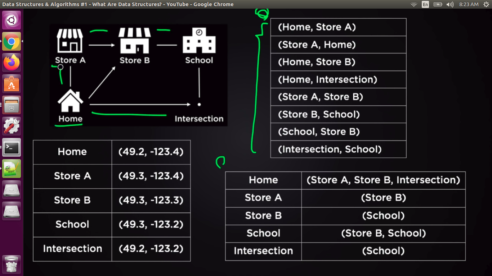
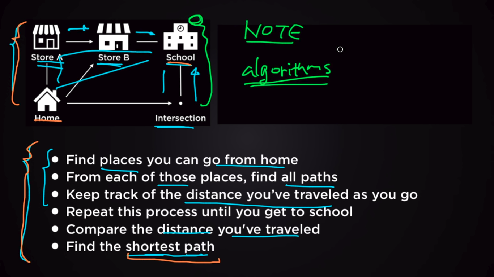
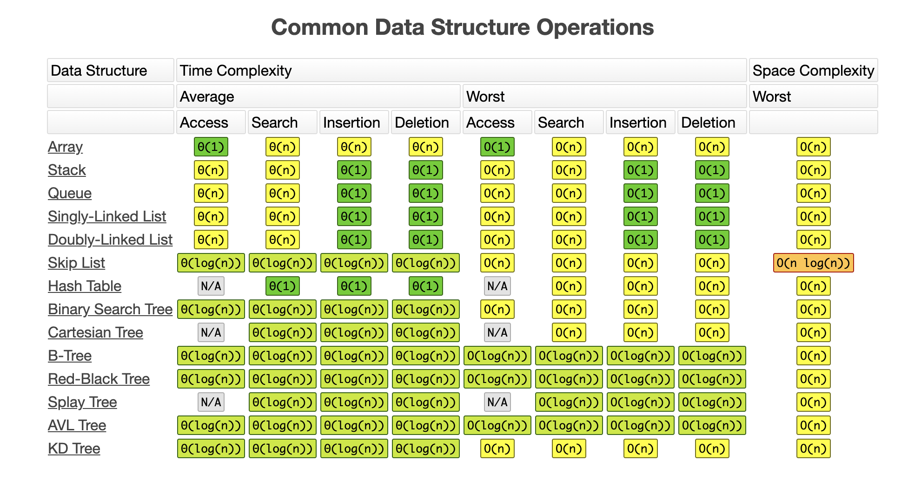

Table of Contents
=================

   * [Introducton to Data Structure and Algorithms](#introducton-to-data-structure-and-algorithms)
      * [Why we need Data Structure?](#why-we-need-data-structure)
      * [Data Structures](#data-structures)
         * [Classification](#classification)
            * [Primitive](#primitive)
            * [Non Primitive](#non-primitive)
         * [Common Operations performed](#common-operations-performed)
      * [Algorithm](#algorithm)
         * [Problem Statement](#problem-statement)
         * [Identify Datastruture](#identify-datastruture)
         * [Define Algorithm](#define-algorithm)
   * [Data Strucutre - Analysis & Implementations](#table-of-contents)
		* [Analysis](#table-of-contents)
			* [Complexity](Complexity.md)
				* [Time Complexity](TimeComplexity.md)	
				* [Space Complexity](SpaceComplexity.md)	
			* [Memory](Memory.md)	
		* [Implementations](#table-of-contents)    
			* [Arrays](Arrays.md)
			* [Linked List](Linkedlist.md)
			* [Hash Table](Hashtable.md)
			* [Stack](Stack.md)
			* [Queue](Queue.md)
			* [Strings](Strings.md)
			* [Graph](Graph.md)
			* [Trees](Trees.md)
   * [Data Strucutre - Complexity Chart](#complexity-chart)

# Introducton to Data Structure and Algorithms

## Why we need Data Structure?
To examine the problem solving skills and for the following  skills

- Basics of coding 
- Foundational data strucutures(Math and Complexity)

## Data Structures

Data Structures is organizing/structuring/managing the data in the memory and it is collection of data values and relationship between the data values in which common operations can be applied. 

### Classification

- Primitive Data Structures
- Non Primitive Data Structures

#### Primitive

Dillinger uses a number of open source projects to work properly:

- Int
- Float
- Char
- Pointer
- Boolean

#### Non Primitive

-  Linear(Sequential)
	- Stack
		- Vector
		- Array
	- Queue
		- Priority Queue
		- List
			- Single linked list
			- Double linked list
			- Circular linked list
	

- Non Linear(Random)
	- Trees 
	- Binary 
	- Binary Search Tree
	- Graph
	- Map
		- HashMap
		- TreeMap
	- Set
		- HashSet
		- TreeSet

### Common Operations performed

- Searching
- Sorting
- Insertion
- Updation
- Deletion

##  Algorithm

A set of instructions or steps that applies on the data strucutures to solve a problem. 

### Problem Statement

-  The problem states that to find the best path between the two points source(home) to destination(school) having  he possible number of paths in the image.

### Identify Datastruture 

-  Array
-  HashTable

### Define Algorithm

-  Apply Algorithm on Datastrucure and its efficiency and complexity varies based on the DataStructure.

## Complexity Chart

